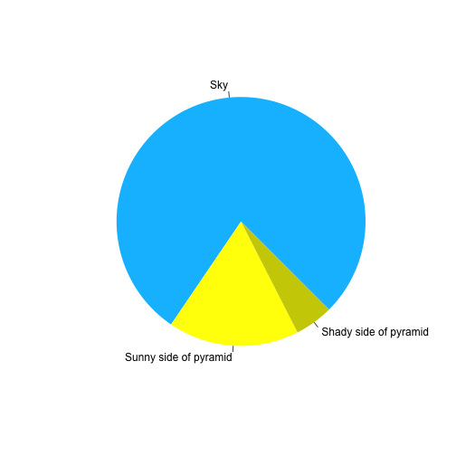

:::::::::::::::::::::::::::::::::::::: questions 

- How do you write a lesson using RMarkdown and `{sandpaper}`?

::::::::::::::::::::::::::::::::::::::::::::::::

::::::::::::::::::::::::::::::::::::: objectives

- Explain how to use markdown with the new lesson template
- Demonstrate how to include pieces of code, figures, and nested challenge blocks

::::::::::::::::::::::::::::::::::::::::::::::::

## Introduction

This is the new Carpentries template. It is written in [RMarkdown][r-markdown],
which is a variant of Markdown that allows you to render code inside the
lesson. Please refer to the [lesson
example](https://carpentries.github.io/lesson-example) for full documentation.

What you need to know is that there are three block quotes required for a valid
Carpentries lesson template:

 1. `questions` are displayed at the beginning of the episode to prime the
    learner for the content.
 2. `objectives` are the learning objectives for an episode displayed with
    the questions.
 3. `keypoints` are displayed at the end of the episode to reinforce the
    objectives.

::::::::::::::::::::::::::::::::::::: challenge 

## Challenge 1: Can you do it?

What is the output of this command?


```r
paste("This", "new", "template", "looks", "good")
```

:::::::::::::::::::::::: solution 

## Output
 

```{.output}
[1] "This new template looks good"
```

:::::::::::::::::::::::::::::::::


## Challenge 2: how do you nest solutions within challenge blocks?

:::::::::::::::::::::::: solution 

You can add a line with at least three colons and a `solution` tag.

:::::::::::::::::::::::::::::::::
::::::::::::::::::::::::::::::::::::::::::::::::

::::::::::::::::::::::::::::::::::::: challenge 

## Challenge 3 : testing if I can make challenges?

What libraries do you have loaded?
Try using `sessionInfo()` to find out

::::::::::::::::::::::: solution


```r
sessionInfo()
```

```{.output}
R version 4.0.5 (2021-03-31)
Platform: x86_64-apple-darwin17.0 (64-bit)
Running under: macOS Catalina 10.15.7

Matrix products: default
BLAS:   /Library/Frameworks/R.framework/Versions/4.0/Resources/lib/libRblas.dylib
LAPACK: /Library/Frameworks/R.framework/Versions/4.0/Resources/lib/libRlapack.dylib

locale:
[1] en_US.UTF-8/en_US.UTF-8/en_US.UTF-8/C/en_US.UTF-8/en_US.UTF-8

attached base packages:
[1] stats     graphics  grDevices utils     datasets  methods   base     

loaded via a namespace (and not attached):
 [1] compiler_4.0.5       magrittr_2.0.1       assertthat_0.2.1    
 [4] tools_4.0.5          fs_1.5.0             stringi_1.5.3       
 [7] knitr_1.32           stringr_1.4.0        xfun_0.22           
[10] evaluate_0.14        sandpaper_0.0.0.9022
```

:::::::::::::::::::::::::::::::::
:::::::::::::::::::::::::::::::::::::


## Figures

You can also include figures:


```r
pie(
  c(Sky = 78, "Sunny side of pyramid" = 17, "Shady side of pyramid" = 5), 
  init.angle = 315, 
  col = c("deepskyblue", "yellow", "yellow3"), 
  border = FALSE
)
```




## Math

One of our episodes contains $\LaTeX$ equations when describing how to create
dynamic reports with {knitr}, so we now use mathjax to describe this:

`$\alpha = \dfrac{1}{(1 - \beta)^2}$` becomes: $\alpha = \dfrac{1}{(1 - \beta)^2}$

Cool, right?

::::::::::::::::::::::::::::::::::::: keypoints 

- Use `.Rmd` files for lessons even if you don't need to generate any code
- Run `sandpaper::check_lesson()` to identify any issues with your lesson
- Run `sandpaper::build_lesson()` to preview your lesson locally

::::::::::::::::::::::::::::::::::::::::::::::::

<!-- Please do not delete anything below this line -->


[cc-by-human]: https://creativecommons.org/licenses/by/4.0/
[cc-by-legal]: https://creativecommons.org/licenses/by/4.0/legalcode
[ci]: https://communityin.org/
[coc-reporting]: https://docs.carpentries.org/topic_folders/policies/incident-reporting.html
[coc]: https://docs.carpentries.org/topic_folders/policies/code-of-conduct.html
[concept-maps]: https://carpentries.github.io/instructor-training/05-memory/
[contrib-covenant]: https://contributor-covenant.org/
[contributing]: {{ repo_url }}/blob/{{ source_branch }}/CONTRIBUTING.md
[cran-checkpoint]: https://cran.r-project.org/package=checkpoint
[cran-knitr]: https://cran.r-project.org/package=knitr
[cran-stringr]: https://cran.r-project.org/package=stringr
[dc-lessons]: https://datacarpentry.org/lessons/
[email]: mailto:team@carpentries.org
[github-importer]: https://github.com/new/import
[jekyll-collection]: https://jekyllrb.com/docs/collections/
[jekyll-install]: https://jekyllrb.com/docs/installation/
[jekyll-windows]: https://jekyll-windows.juthilo.com/
[jekyll]: https://jekyllrb.com/
[jupyter]: https://jupyter.org/
[kramdown]: https://kramdown.gettalong.org/
[lc-lessons]: https://librarycarpentry.org/lessons/
[lesson-aio]: {{ relative_root_path }}
[lesson-coc]: {{ relative_root_path }}
[lesson-example]: https://carpentries.github.io/lesson-example/
[lesson-license]: {{ relative_root_path }}
[lesson-mainpage]: {{ relative_root_path }}
[lesson-reference]: {{ relative_root_path }}
[lesson-setup]: {{ relative_root_path }}
[mit-license]: https://opensource.org/licenses/mit-license.html
[morea]: https://morea-framework.github.io/
[numfocus]: https://numfocus.org/
[osi]: https://opensource.org
[pandoc]: https://pandoc.org/
[paper-now]: https://github.com/PeerJ/paper-now
[python-gapminder]: https://swcarpentry.github.io/python-novice-gapminder/
[pyyaml]: https://pypi.python.org/pypi/PyYAML
[r-markdown]: https://rmarkdown.rstudio.com/
[rstudio]: https://www.rstudio.com/
[ruby-install-guide]: https://www.ruby-lang.org/en/downloads/
[ruby-installer]: https://rubyinstaller.org/
[rubygems]: https://rubygems.org/pages/download/
[styles]: https://github.com/carpentries/styles/
[swc-lessons]: https://software-carpentry.org/lessons/
[swc-releases]: https://github.com/swcarpentry/swc-releases
[training]: https://carpentries.github.io/instructor-training/
[workshop-repo]: {{ site.workshop_repo }}
[yaml]: https://yaml.org/
